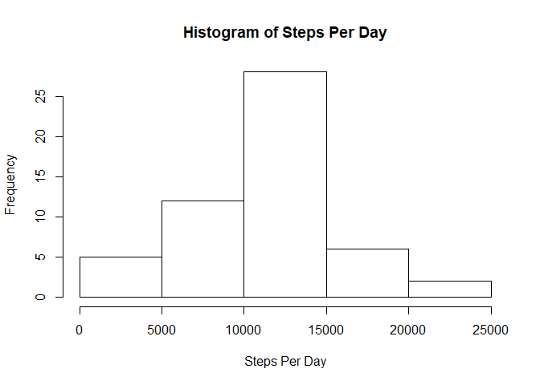
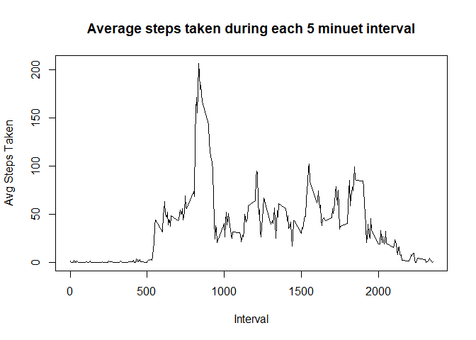
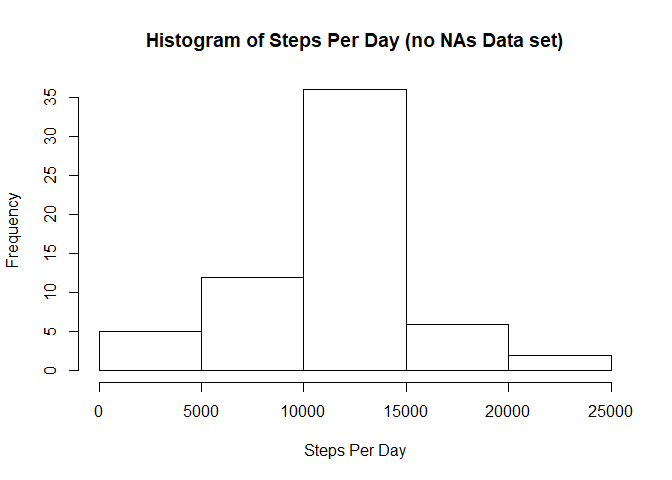
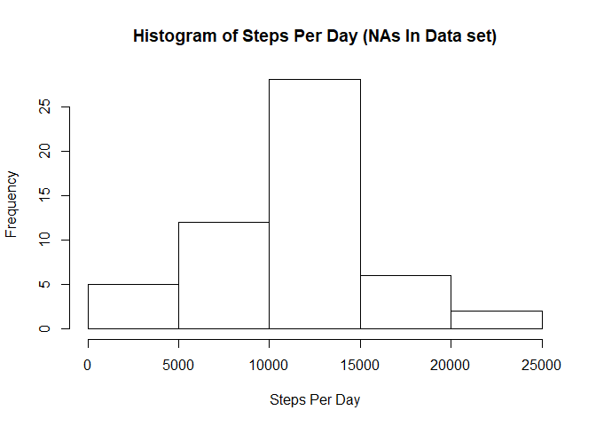
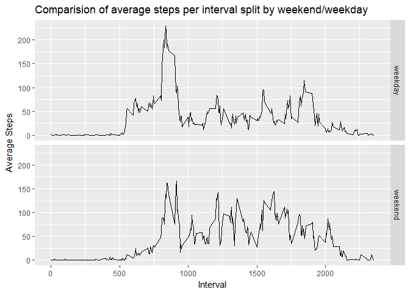

This doucment will walk through the analysis carried out by the author to solve the questions presented in this assignment


## Loading and preprocessing the data
to perform this analysis, a few packages were required, namely dplyr for data manipulation, chron for date manipulation and ggplot2 for some of the plotting. lets load these in and read in the CSV file. the raw data is stored in data_raw data frame. I then change the date field to be actual date format with the as.date function


```r
library(dplyr)
```

```
## 
## Attaching package: 'dplyr'
```

```
## The following objects are masked from 'package:stats':
## 
##     filter, lag
```

```
## The following objects are masked from 'package:base':
## 
##     intersect, setdiff, setequal, union
```

```r
library(chron)
library(ggplot2)
data_raw <- read.csv("activity.csv")
data_raw$date <- as.Date(data_raw$date, format = "%Y-%m-%d")
```

later in this document, you will see how i split the data into different formats to perform analysis


## What is mean total number of steps taken per day?

part 1 of this question asks us to calculate the total number of steps taken per day. i chose to do this by using the aggregate function.

I then create a dataset call data_days to store this aggregation


```r
data_days <- aggregate(data_raw["steps"],
                       by = data_raw["date"],
                       sum)
head(data_days)
```

```
##         date steps
## 1 2012-10-01    NA
## 2 2012-10-02   126
## 3 2012-10-03 11352
## 4 2012-10-04 12116
## 5 2012-10-05 13294
## 6 2012-10-06 15420
```


part 2 of this question asks us to create a histogram of the steps taken per day


```r
hist(data_days$steps,
     xlab = "Steps Per Day",
     main = "Histogram of Steps Per Day")
```

<!-- -->


finally we are asked to calculate the mean and median steps taken per day. this is easily done with the summary function. this also gives the bonus stats of the quartiles


```r
summary(data_days$steps)
```

```
##    Min. 1st Qu.  Median    Mean 3rd Qu.    Max.    NA's 
##      41    8841   10765   10766   13294   21194       8
```


## What is the average daily activity pattern?

the first part of this question asks us to make a time series plot based on the average steps per interval accross all the days in the dataset. again I used the aggregate function to aggregate the data and store it in a dataframe called data_Int_Avg

```r
data_Int_Avg <- aggregate(data_raw["steps"],
                          by = data_raw["interval"],
                          na.rm=TRUE,
                          mean)

colnames(data_Int_Avg) <- c("interval", "avg_steps")
```
    
I then use the base plot function to create the time series graph

```r
plot(data_Int_Avg$interval,
     data_Int_Avg$avg_steps,
     type = "l",
     main = "Average steps taken during each 5 minuet interval",
     xlab = "Interval",
     ylab = "Avg Steps Taken")
```

<!-- -->
  
finally we are asked to find the interval with the highest average steps. I chose to do this using the which.max function to find the index of the highest average step interval. I then search that index in the interval column to find the answer

```r
data_Int_Avg$interval[which.max(data_Int_Avg$avg_steps)]
```

```
## [1] 835
```
  

## Imputing missing values
firstly, we are asked to calculate the total number of missing values in a dataset. this is easily done using a combination of is.na to find miussing values and table() to tabulate the totals


```r
table(is.na(data_raw$steps))
```

```
## 
## FALSE  TRUE 
## 15264  2304
```


we are then asked to come up with a method for imputing the missing values and filling them in in another data frame. I chose to use the average value we have already calculated per interval as that would be a fair guess as to how many steps the person took in that time. below is the code to impute those missing values

```r
data_no_NA <- left_join(data_raw, data_Int_Avg, by = "interval")
data_no_NA$steps <- ifelse(is.na(data_no_NA$steps), data_no_NA$avg_steps, data_no_NA$steps)
data_no_NA$avg_steps <- NULL
table(is.na(data_no_NA$steps))
```

```
## 
## FALSE 
## 17568
```
the above code creates a new dataframe called data_no_NA and ass the the raw data from data_raw, as well as the average step count for each interval.  
it will then use the ifelse() function to test if the step value for each line is an NA, if so it will replace it with the average for that interval.  
it then removes the average steps column as it is no longer needed and tables the is.na results to prove all missing values are gone.

finally we are asked to create a histrogram based on the new dataset for the count of steps per day and then compare our results to the previous histogram. to achieve this i make another dataset that is aggregated to sum the steps per day and then create the historgram


```r
data_days_no_NAs <- aggregate(data_no_NA["steps"], 
                              by = data_no_NA["date"], 
                              sum)

hist(data_days_no_NAs$steps,
     xlab = "Steps Per Day",
     main = "Histogram of Steps Per Day (no NAs Data set)")
```

<!-- -->

```r
hist(data_days$steps,
     xlab = "Steps Per Day",
     main = "Histogram of Steps Per Day (NAs In Data set)")
```

<!-- -->

as you would expect, adding in missing values as the mean values onyl serves to add more days to the median bucket for the histrogram, so in general it is quite a good way to impute missing data.

finally we are asked to show the mean and median steps per day for this new dataset and compare to the old data set


```r
summary(data_days_no_NAs$steps)
```

```
##    Min. 1st Qu.  Median    Mean 3rd Qu.    Max. 
##      41    9819   10766   10766   12811   21194
```

```r
summary(data_days$steps)
```

```
##    Min. 1st Qu.  Median    Mean 3rd Qu.    Max.    NA's 
##      41    8841   10765   10766   13294   21194       8
```

again, as expected, the mean and median change very little due to the fact that missing values were imputed using the median averages.


## Are there differences in activity patterns between weekdays and weekends?
we are firstly asked to add a factor variable to our imputed data set specifying if the row is part of the weekend or weekday. i did this using ifelse and is.weekend to test each date


```r
data_no_NA$weekend <- ifelse(is.weekend(data_no_NA$date),"weekend", "weekday")
data_no_NA$weekend <- as.factor(data_no_NA$weekend)
```

we are then asked to make a panel plot of the interval averages split by weekend vs weekday.
to achieve this i used the dplyr pacage to group the data dy weekend and interval, then used summarise to get the mean


```r
data_int_wd_avg <- data_no_NA %>% group_by(weekend, interval) %>% summarise(mean = mean(steps))
```

I then used ggplot to plot the panels

```r
ggplot(data = data_int_wd_avg, 
      aes(x = interval, y = mean)) + 
      geom_line() + 
      facet_grid(weekend ~.) + 
      ggtitle("Comparision of average steps per interval split by weekend/weekday") + 
      labs(x="Interval", y="Average Steps")
```

<!-- -->
